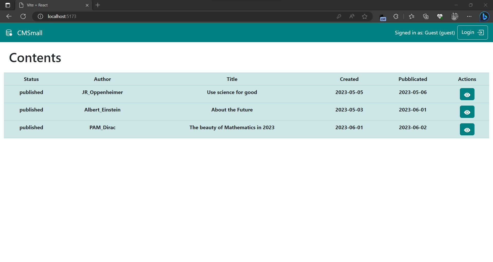
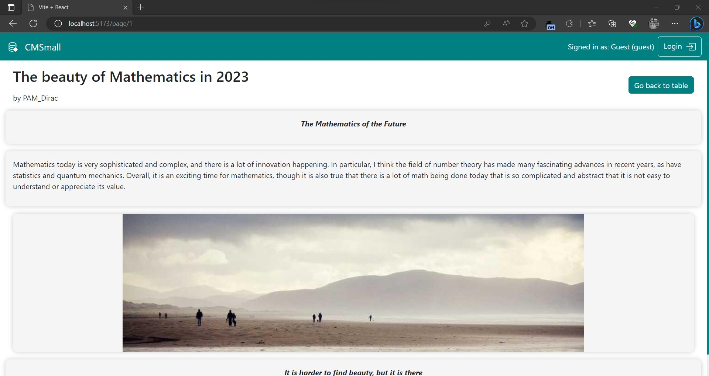
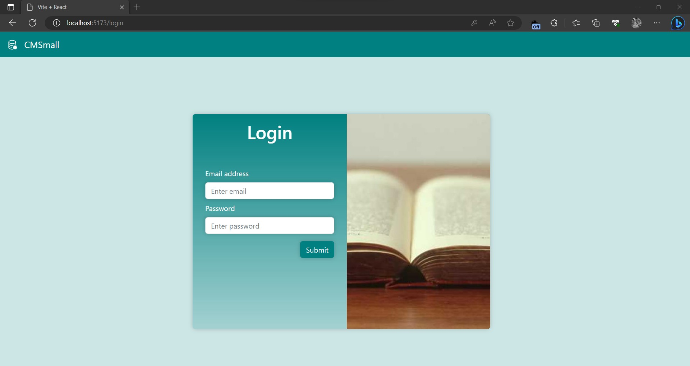
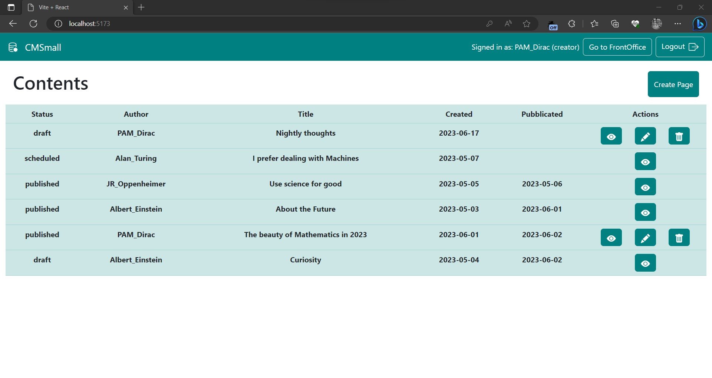
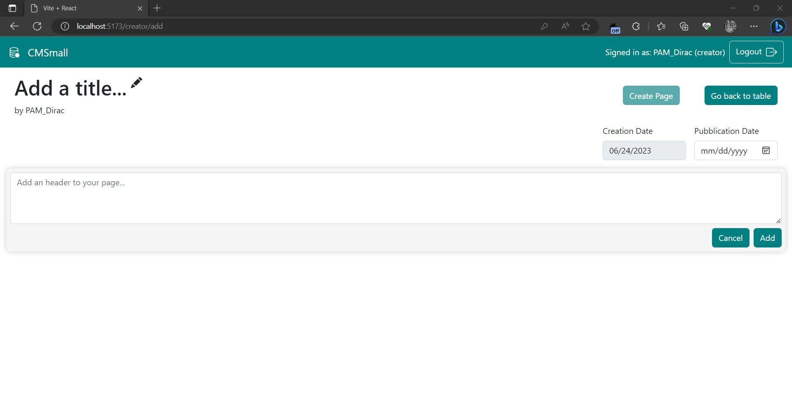
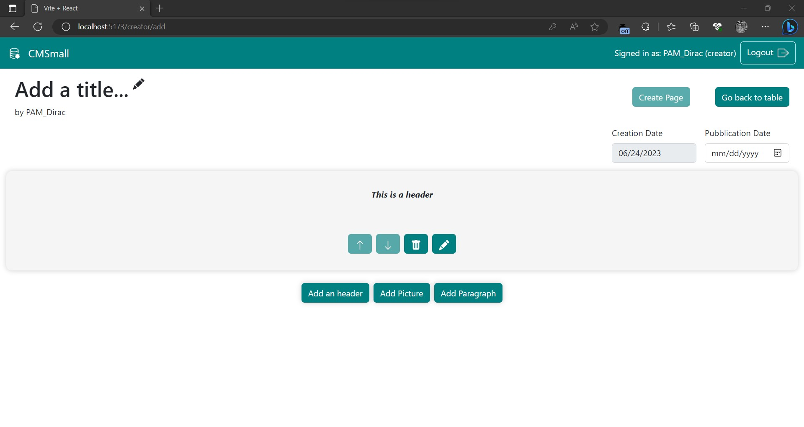
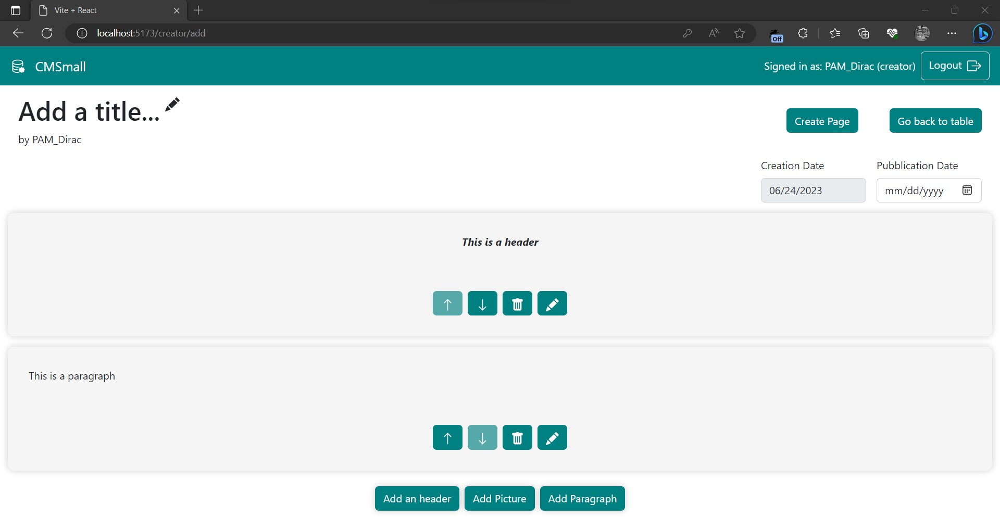

[](https://classroom.github.com/a/_XpznRuT)
# Exam #1: "CMSmall"

## Student: s307746 GIULIA DI FEDE 

# Server side

## API Server

### SESSIONS
  - POST	`/api/sessions`
    - request parameters: ```empty```
    - request body
      ``` 
      {
        username: email, 
        password: password
      } 
      ```          
    - response body
      ```
      { 
        id: ID, 
        username: email, 
        username_name: username, 
        role: admin/creator 
      }
      ```
  - GET	`/api/sessions/current`
    - request parameters
    - request body: ```empty```
    - response body:
      { 
        id: ID of the user, 
        username: email , 
        username_name: username, 
        role: admin/creator 
      }
  - DELETE		`/api/sessions/current`
    - request parameters: ```empty```
    - request body: ```empty```
    - response body: ```empty```

### PAGES
  - GET		`/api/pages`
    - request parameters: ```empty```
    - request body: ```empty```
    - response body: [
      {
        id: id of the page,
        userID: id of the author of the page,
        username: username of the author,
        type: draft/scheduled/published,
        title: title of the page,
        creationDate: creation date of the page,
        publicationDate: publication date of the page
      }
      ...
    ]
    - error (500) Database Error

  - GET		`/api/pages/published`
    - request parameters: ```empty```
    - request body: ```empty```
    - response body: [
      {
        id: id of the page,
        userID: id of the author of the page,
        username: username of the author,
        type: published,
        title: title of the page,
        creationDate: creation date of the page,
        publicationDate: publication date of the page
      }
      ...
    ]
    - error (500) Database Error

### PAGE
  - GET 	`/api/page/:pageID`
    - request parameters: ```pageID``` (ID of the page to be fetched)
    - request body: ```empty```
    - response body:
    ```
    {
      page: {
        id: id of the page,
        userID: id of the author of the page,
        username: username of the author,
        type: draft/scheduled/published,
        title: title of the page,
        creationDate: creation date of the page,
        publicationDate: publication date of the page
      },
      contents:
      [
        { 
          id: id of the block,
          type: type of the block,
          content: link or text,
          position: position of the block in the page
        },
        ...
      ]
    }
    ```
    - error (500) Database Error

  - POST	`/api/page`
    - request parameters: ```empty```
    - request body: 
    ```
    {
      page: {
        id: id of the page,
        userID: id of the author of the page,
        username: username of the author,
        type: draft/scheduled/published,
        title: title of the page,
        creationDate: creation date of the page,
        publicationDate: publication date of the page
      },
      contents:
      [
        { 
          id: id of the block,
          type: type of the block,
          content: link or text,
          position: position of the block in the page
        },
        ...
      ]
    }
    ```
    - response body: ```empty```
    - error (500) Database Error
    - error (422) Unprocessable Content

  - PUT		`/api/page/:pageID` 
    - request parameters: ```pageID``` (ID of the page to be modified)
    - request body:
    ```
    {
      page: {
        id: id of the page,
        userID: id of the author of the page,
        username: username of the author,
        type: draft/scheduled/published,
        title: title of the page,
        creationDate: creation date of the page,
        publicationDate: publication date of the page
      },
      up: [
        { ID, type, content, position },
        ...
      ], 
      add: [
        { ID, type, content, position },
        ...
      ],
      del: [
        { ID, type, content, position },
        ...
      ]
      
    }
    ```
    - response body: ```empty```
    - error (500) Database Error
    - error (403) Forbidden
    - error (422) Unprocessable Content


  - DELETE	`/api/page/:pageID`
  	- request parameters: ```pageID``` (ID of the page to be deleted)
    - request body: ```empty```
    - response body:```empty```
    - error (500) database error
    - error (403) Forbidden 

### IMAGES
  - GET		`/api/images`
    - request parameters: ```empty```
    - request body: ```empty```
    - response body:
    ``` 
    {
      id: id of the image,
      link: static link of the image
    }
    ```
    - error (500) database error

### TITLE
  - PUT		`/api/title`
    - request parameters: ```empty```
    - request body: 
      ```
      { 
        title: new title of the website
      }
      ```
    - response body: ```empty```
    - error (500) database error
    - error (403) Forbidden 

  - GET		`/api/title`
    - request parameters: ```empty```
    - request body: ```empty```
    - response body: 
    ```
    {
      title: title of the website
    }
    ```
    - error (500) database error
    - error (422) Unprocessable Content

### AUTHOR
  - PUT		`/api/author`
  	- request parameters: ```empty```
    - request body: 
        ```
        { 
          authorID 
        }
        ```
    - response body: ```empty```
    - error (500) database error
    - error (403) Forbidden 

## Database Tables
  - Table `settings` - contains ID, name, value
  - Table `imagesTable` - contains ID, link
  - Table `pagesTable` - contains ID, authorID, type, title, creationDate, pubblicationDate
  - Table `contentTable` - contains ID, pageID, type, content, position
  - Table `usersTable` - contains ID, username, email, type, salt, password (hashedPassword)

# Client side

## React Client Application Routes

- Route `/` -> Table of Contents
- Route `/login` -> Login page
- Route `/creator/add` -> Section dedicated to the creation of a new page
- Route `/creator/edit/:pageid` -> Section dedicated to the modification of a specific page
- Route `/page/:pageid` -> Section dedicated to showing a specific page 

## Main React Components

  - `Login`: Main component dedicated to Login 
    - `Login Button`: Handles Login form submission
    - `Logout Button`: handles Logout 

  - `NotFound`: Component used to show the user the route they selected is not available

  - `PageEditorView`: Main component dedicated to Modification and Adding of a page
    - `Title`: Component dedicated to inline editing of the title of the page
    - `Author`: Component dedicated to inline editing of the author of the page, unlocked only for admin
    - `HeaderAdder`: Component consisting of a textarea  used to add an header
    - `PictureAdder`: Component used to add a picture through the selection of thumbnails 
      - `PictureThumbnail`: Component used to select a new picture, on click the picture is selected
    - `ContentAdder`: Component consisting of three buttons to select the typo of content to add, only visible when no content is being added
    - `ParagraphAdder`: Component consisting of a textarea used to add a paragraph

  - `PagesTable`: Main component that shows the table of contents
    - `Row`: Single row of the table
      - `Actions`: Coomponent containing actions used to delete/view/edit a page
 
  - `PageView`: Main component used to show a page
    - `Header`: Not editable component used to show an header
    - `Picture`: Not editable component used to show a picture
    - `Paragraph`: Not editable component used to show a paragraph
 
  - `shared/Alerts`: components used to show Success and Error messages
    - `Error`: Component used to show an error message
    - `Success`: Component used to show a success message
 
  - `shared/Blocks`: Components used by PageEditorView to edit the elements of a page
    - `HeaderEditor`: Component dedicated to the inline modification of the header
    - `ParagraphEditor`: Component dedicated to the inline modification of the paragraph
    - `PictureEditor`: Component dedicated to the inline modification of the picture
    - `ContentButtons`: Buttons including "Move up", "Move Down", "Edit" and "Delete", offering the possibility to reorder the elements in the Page, delete a content and edit a content.
 
  - `shared/MyNavbar`: Main Navbar Component
    - `OfficeButton`: Component used to switch between frontoffice and backoffice
 
  - `shared/SpinnerComponent`: Just a spinner 

# Usage info
The landing page of the application shows the table of contents as seen by a Guest user, who can only see published pages. In the Navbar it is possible to navigate to the login area.


The page dedicated to the visualization of the page contains the blocks of content highlighted by a shadow box, it shows the title and the author.


To Login as Creator (Manager) or as Admin the user needs to write email and password, in the dedicated page below.


After Logging in as a Creator, the user is now able to switch between Front Office and Back Office, as well as log out, as shown in the screenshot. To create a page, the user can now click on the visible "Create Page".


At page creation, the user is presented with a first header adder, as a page must have at least one header, the buttons used to select other kinds of elements are deactivated and not visible. The create page button is disabled until there is at least one header and one block between paragraph and picture. It is also possible to modify the title and the pubblication date. As an Admin, it is also possible to modify the author of the page.

Each element has the possibility to reorder the elements in the page, to delete them or to edit them inline. 




The editing of the page is presented in the same way as the creation of the page.

As an admin, in the page dedicated to the table it is possible to modify the title of the website in an inline fashion. To confirm the modification of the title, press the 'Enter' key.


## Users Credentials

- (Admin) admin@example.com, password5
- (User) pamdirac@example.com, password1 